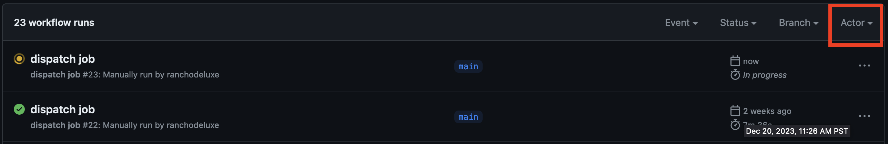
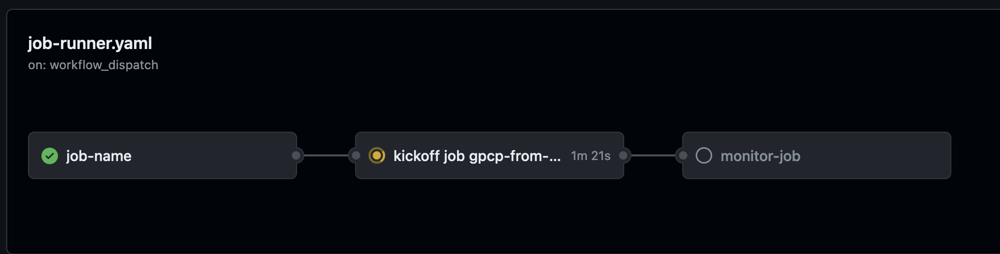
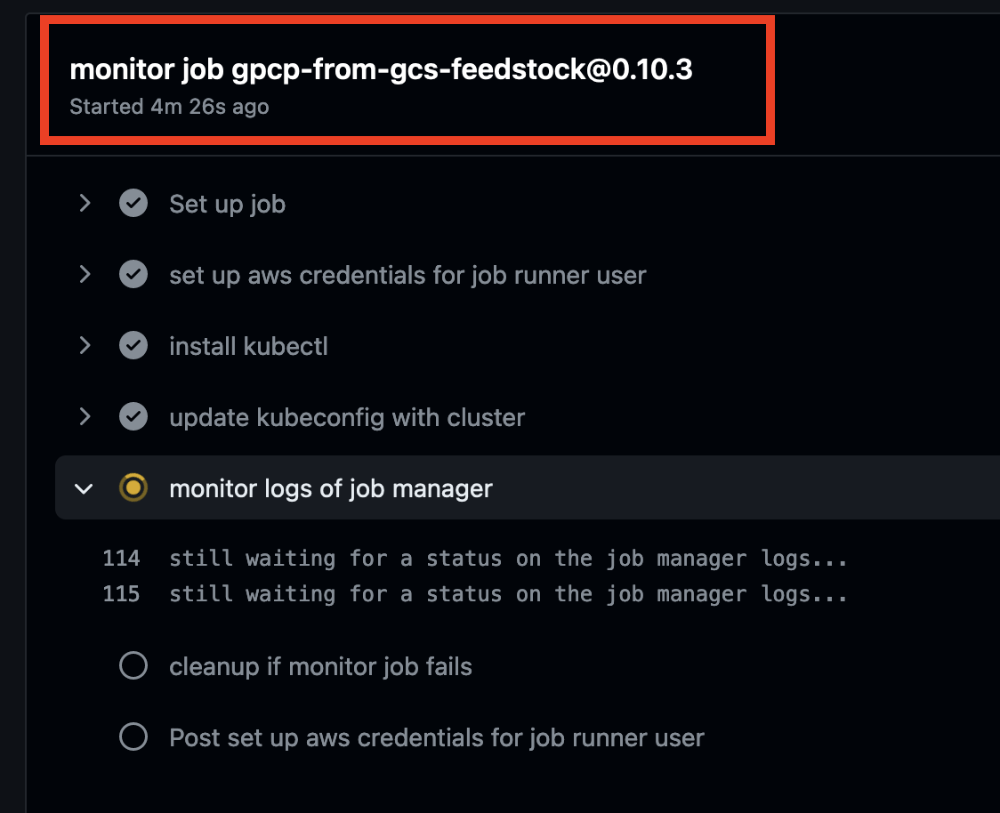

## veda-pforge-job-runner
EMR Serverless + Apache Beam Job Runner


---

### Getting Started

1. Create a [personal access token in Github](https://docs.github.com/en/enterprise-server@3.9/authentication/keeping-your-account-and-data-secure/managing-your-personal-access-tokens) with the "workflow" scope


2. To kick off jobs on GH you'll need to provide inputs. Note that `.github/workflows/job-runner.yaml` in this repository describes the allowed inputs and defaults. Currently, the only non-defaulted required inputs are `repo` and `job_name`:

    ```yaml
   on:
     workflow_dispatch:
       inputs:
         repo:
           description: 'The https github url for the recipe feedstock'
           required: true
         ref:
           description: 'The tag or branch to target in your recipe repo'
           required: true
           default: 'main'
         feedstock_subdir:
           description: 'The subdir of the feedstock directory in the repo'
           required: true
           default: 'feedstock'
         spark_params:
           description: 'space delimited --conf values: https://docs.aws.amazon.com/emr/latest/EMR-Serverless-UserGuide/jobs-spark.html'
           required: true
           default: '--conf spark.executor.cores=16 --conf spark.executor.memory=60G --conf spark.executor.memoryOverhead=60G --conf spark.driver.memory=10G --conf spark.driver.memoryOverhead=4G --conf spark.shuffle.file.buffer=64k --conf spark.default.parallelism=1280 --conf spark.emr-serverless.executor.disk=200G'
         job_name:
           description: 'Name the EMR job'
           required: true
    ```

#### Manual Trigger Option:

3. Head to [GH Action tab](https://github.com/NASA-IMPACT/veda-pforge-job-runner/actions). Select the job you want to run from the left-hand navigation, under "Actions". The current job name is "dispatch job". Since the "dispatch job" workflow has a `workflow_dispatch` trigger, you can select "Run workflow" and use the form to input suitable options.
 
#### Curl Trigger Option:

3. Construct a JSON snippet that describes the recipe inputs you want to run like the example below (this example actually describes the integration tests). We'll pass this to GH Actions in future examples below via a `curl` POST.

    ```bash
    # NOTE that any arguments for your recipe run will be added to the `inputs` hash
    # The first-level `ref` below refers to which branch in this GH repositry we want to run things against 
    '{"ref":"main", "inputs":{"repo":"https://github.com/pforgetest/gpcp-from-gcs-feedstock.git","ref":"0.10.3"}}'
    ```

4. Fire off a `curl` command to Github. Replace `<your-PAT-here>` with the one you created in step one above. And replace `<your-JSON-snippet-here>` with the one you created in step two above:

    ```bash
       curl -X POST \
         -H "Accept: application/vnd.github+json" \
         -H "X-GitHub-Api-Version: 2022-11-28" \
         -H "Authorization: token <your-PAT-here>" \
         https://api.github.com/repos/NASA-IMPACT/veda-pforge-job-runner/actions/workflows/job-runner.yaml/dispatches \
         -d <your-JSON-snippet-here>
    ```
   
    ```bash
      # INTEGRATION TEST EXAMPLE
      curl -X POST \
         -H "Accept: application/vnd.github+json" \
         -H "X-GitHub-Api-Version: 2022-11-28" \
         -H "Authorization: token blahblah" \
         https://api.github.com/repos/NASA-IMPACT/veda-pforge-job-runner/actions/workflows/job-runner.yaml/dispatches \
         -d '{"ref":"main", "inputs":{"repo":"https://github.com/pforgetest/gpcp-from-gcs-feedstock.git","ref":"0.10.3"}}'
    ```

5. Head to this repository's [GH Action tab](https://github.com/NASA-IMPACT/veda-pforge-job-runner/actions)

6. If multiple jobs are running you can get help finding your job using the "Actor" filter



7. There are three subjobs to each job: **A)** name the job **B)** kick it off (send it to the k8s cluster) and **C)** monitor the job (which tells you the status of your running work)



8. If you have multiple running jobs then each GH subjob gets a unique name that describes the `<repo>@<ref>` that is running




9. Continue to come back to the "monitor" subjob to see if it passes or fails. In the future there will be some mild heuristics in place that should tell you why it fails based on what it sniffs in the logs. For now it sniffs for the correct job status within a time limit of two hours
